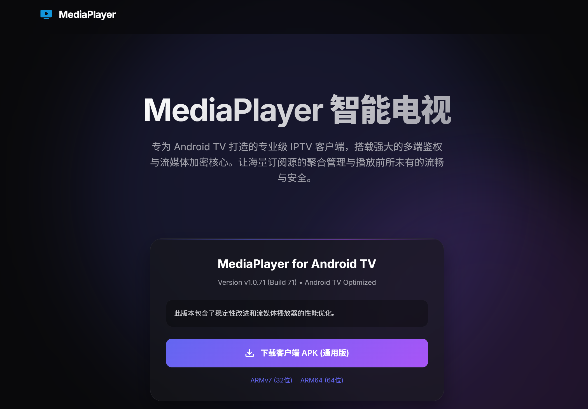
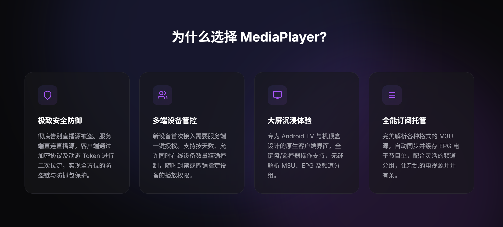

<div align="center">
  
  <h1>MediaPlayer 智能电视流媒体中心</h1>
  <p><b>专为 Android TV 与机顶盒打造的专业级 IPTV 私有化流媒体系统 / Enterprise-grade private IPTV streaming system for Android TV</b></p>
  <p><a href="#中文">中文</a> | <a href="#english">English</a></p>
</div>

---

<a name="中文"></a>
## 🇨🇳 中文说明

### 🌟 核心理念

MediaPlayer 并不是一个普通的本地播放器，而是一套**「服务端管控 + 客户端沉浸播放」**的完整私有化流媒体解决方案。

它致力于帮助您将海量、杂乱的 M3U 直播源和 EPG 电子节目单，转化为如同“有线电视”一般顺滑、有组织的观影体验。经过数个版本的迭代与进化，MediaPlayer 现已具备强悍的流媒体代理、实时会话管控、无感健康检查及客户端 OTA 自动升级等高级企业级特性，让您的独家直播源从此告别被盗链、被抓包的风险，同时极大降低运维成本。

---

### 截图





---

### ✨ 核心产品特色

#### 🛡️ 1. 极致的安全防御与流管理
- **源站隐身 (Proxy Mode)**：客户端不再直接向真实的直播源发起请求，所有的 M3U 订阅、EPG 获取和视频流拉取均由服务端代理转发，真实源地址完全隐身。
- **流媒体多路复用 (Multiplexing)**：支持代理流复用技术。当多个家庭成员 or 设备同时观看同一频道时，服务端只向真实源站拉取一路视频流，极大节省您的网络下行与上行带宽。
- **直连与代理随心切换**：支持频道和分组级别的“直连/代理”模式配置，兼顾播放速度与源站安全。
- **动态 Token 鉴权**：客户端通过加密协议及动态生成的 Token 进行二次拉流，实现全方位的防盗链与防抓包保护，彻底告别直播源被恶意窃取。

#### 👥 2. 强大的多端设备与会话管控
- **一键准入机制**：新设备首次下载安装客户端后无法直接播放，需要服务端管理后台的“一键授权”，防止陌生设备蹭网。
- **活跃流实时监控**：在后台管理面板中，实时监控所有在线播放的客户端会话。支持查看设备的 IP、实时下载网速（KB/s）、播放的频道及历史活跃时间。
- **一键“踢下线”**：一旦发现异常占用或超时，可随时在后台一键“强制熔断”指定设备的流传输，精准切断播放。
- **全方位审计日志**：详细记录所有客户端的心跳、登录、播放动作及错误日志，随时掌控设备运行状态。

#### 📺 3. 大屏沉浸式体验
- **原生 TV 界面**：专为 Android TV（智能电视、网络机顶盒）大屏设计的原生客户端界面，操作丝滑流畅，支持多格式硬件解码。
- **完全适老化操作**：深度适配电视遥控器和全键盘操作，老人小孩无需学习即可通过方向键 and 确认键完成频道切换、菜单呼出等操作。
- **毫秒级换台**：内置深度优化的底层播放内核（基于 ExoPlayer / VLC），在弱网环境下依然能做到秒开换台。

#### 📂 4. 自动化源站运维与管理
- **无缝解析 M3U**：完美兼容各种复杂格式的 M3U/M3U8 直播源文件。
- **无感健康检查**：内置频道健康检查机制，支持在后台平滑扫描失效源，自动剔除或标注不可用频道，完全不影响正在播放的用户。
- **灵活的频道分组**：支持在服务端灵活拖拽排序、批量调整频道分类，让再杂乱无章的电视源都能变得井井有条。
- **EPG 自动同步**：自动同步并缓存 EPG（电子节目单），让观众随时知道“正在播放什么”和“接下来播放什么”。

#### 🔄 5. 无忧的自动版本升级 (OTA)
- **服务端一键拉取**：管理后台深度集成了 GitHub Releases，可自动检测最新版本，并一键下载最新版 APK 到服务端。
- **客户端平滑升级**：电视端每次启动时自动与服务端校验版本。当有新版时，直接从私有服务端高速下载更新并弹出安装提示，从此告别 U盘繁琐拷贝升级。

#### 🔐 6. VIP 授权订阅
- **硬件指纹绑定**：授权码与服务器硬件唯一绑定，防止未授权部署。
- **离线授权工具**：提供 `license-gen.exe` 离线生成授权码，输入机器码和过期时间即可生成。
- **一键激活**：在管理后台「全局设置 → VIP 授权订阅」中输入授权码即可激活，激活后解锁远程配置等高级功能。
- **自动续期检测**：服务端启动时自动校验授权状态，过期或机器码不匹配时自动失效。

#### ⚙️ 7. 远程配置管理
- **全局配置下发**：在管理后台「全局设置」中统一配置所有客户端의 播放器参数（解码模式、画面比例、缓存策略、DNS 策略等）。
- **设备级配置覆盖**：支持对单个设备进行独立配置，覆盖全局设置。
- **界面管控**：支持远程隐藏客户端面板（设置栏、频道列表、EPG 节目单、OSD 信息栏），隐藏后客户端操作时提示"管理员已禁用此功能"。
- **配置项隐藏**：支持将特定设置项在客户端 UI 中隐藏，防止用户自行修改关键参数。

---

### 🚀 部署与使用

> 本项目分为**服务端（Backend）**和**客户端（Android App）**两部分。服务端提供核心的流代理、设备管控与后台面板，客户端则安装在电视或机顶盒上提供播放界面。

#### 1. 服务端部署
##### 方法一：Docker
通过公开提供的 Docker 镜像，只需一行命令即可在任何 Linux/NAS 环境中快速拉起服务端：
```bash
docker run -d \
  -p 9527:9527 \
  -v /path/to/your/data:/app/data \
  --name mediaplayer-server \
  ghcr.io/kuai410022283/mediaplayer:latest
```
*(部署完成后，即可通过浏览器访问 Web 管理后台，上传您的 M3U 文件并管理设备。)*

> **🔧 自定义密钥**：如需自定义授权加密密钥，编译时设置环境变量 `LICENSE_SECRET=你的密钥种子`。服务端和 `license-gen.exe` 须使用相同的密钥种子。

##### 方法二：[飞牛OS应用](https://github.com/Brian099/fn_fpk_packages/blob/main/README.md)
下载获取mediaplayer.fpk最新服务端，按照说明进行安装

##### 方法三：[群晖套件](https://github.com/kuai410022283/syno-mediaplayer)
下载获取mediaplayer.spk最新服务端，按照说明进行安装

##### 方法四：手动命令安装
```bash
sudo chmod 0755 mediaplayer
./mediaplayer
```

##### 📦 服务端支持架构一览

请根据您的设备架构，从 [Releases 页面](https://github.com/kuai410022283/mediaplayer/releases) 下载对应的二进制包。

**二进制包（tar.gz）**

| 架构 | 文件名 | 适用设备 | 部署方式 |
|------|--------|---------|---------|
| x86-64 | `mediaplayer-linux-amd64.tar.gz` | 软路由（N100/J4125）、NAS、VPS、PVE虚拟机 | 二进制 |
| ARM64 | `mediaplayer-linux-arm64.tar.gz` | 晶晨 S905/S922X、树莓派4+、NAS、瑞芯微 RK3588 | 二进制 |
| ARMv7l | `mediaplayer-linux-arm-armv7l.tar.gz` | 树莓派2/3、晶晨旧款 S805、老款 NAS | 二进制 |
| 龙芯 LoongArch | `mediaplayer-linux-loong64.tar.gz` | 龙芯 3A5000 / 3A6000 及以上 | 二进制 |
| RISC-V 64 | `mediaplayer-linux-riscv64.tar.gz` | VisionFive 2、Milk-V Pioneer 等新兴平台 | 二进制 |
| macOS (Intel) | `mediaplayer-darwin-amd64.tar.gz` | Intel Mac | 二进制 |
| macOS (Apple) | `mediaplayer-darwin-arm64.tar.gz` | Apple Silicon Mac（M1/M2/M3） | 二进制 |
| Windows | `mediaplayer-windows-amd64.zip` | Windows PC | 二进制 |

**Docker 多架构镜像**（同一镜像标签，按宿主机自动匹配）

| 平台 | 适用设备 |
|------|---------|
| `linux/amd64` | 软路由、NAS、VPS |
| `linux/arm64` | 晶晨 S905/S922X、树莓派4+、NAS |
| `linux/arm/v7` | 树莓派2/3、ARMv7 设备 |

> **💡 不确定自己的架构？** 在设备 SSH 终端运行 `uname -m` 查看：
> - `x86_64` → 下载 `amd64`
> - `aarch64` / `arm64` → 下载 `arm64`
> - `armv7l` → 下载 `arm-armv7l`
> - `loongarch64` → 下载 `loong64`
> - `riscv64` → 下载 `riscv64`

#### 2. 客户端安装

请前往本仓库的 **[Releases 页面](https://github.com/kuai410022283/mediaplayer/releases)** 下载最新版本的 `mediaplayer-x.x.x-release.apk`。
- 将 APK 放入 U盘插入电视进行安装，或者通过当贝市场等第三方工具推送到电视端。
- 打开 App 后，系统会自动生成设备唯一识别码，将其提供给服务端管理员进行授权即可开启观影之旅。

---

### 🎮 客户端操作说明

客户端经过深度适老化与全平台兼容设计，同时支持**电视遥控器**按键操作与**手机/平板设备**的触控手势操作。

> **操作速查表**

| 功能区域 | 操作 | 📱 触控/手势 | 📺 遥控操作 |
|---------|------|-------------|-------------|
| **OSD 信息** | 显示信息栏（5 秒自动隐藏） | `单击` (Tap) | `OK 键` |
| **频道列表** | 呼出 | `右滑` (→) | `左键` (←) |
| | 关闭 | `左滑` (←) | `返回键` (BACK) |
| | 浏览频道 | — | `上/下键` |
| | 切换分组 | — | 频道列表中 `左/右键` |
| | 播放选中频道 | — | `OK 键` |
| **EPG 节目单** | 呼出 | `左滑` (←) *无面板时* | 频道列表中焦点 `右键 →` |
| | 关闭 | `右滑` (→) | `返回键` (BACK) |
| **换台** | 上一台 / 下一台 | `上滑` / `下滑` | `上/下键` *无面板时* |
| **设置栏** | 呼出 / 隐藏 | `双击` (Double Tap) | `Menu 键` |
| **线路切换** | 手动选择直播源 | `长按` (Long Press) | `长按 OK 键` |
| **亮度/音量** | 调节亮度与音量 | `屏幕左/右侧上下滑动` | 遥控器 `音量+/-` 键 |
| **音轨/字幕** | 呼出切换面板 | `单击 OSD 上的按钮` | `INFO 键` |
| **点播控制** | 暂停 / 播放 (仅点播模式) | `OSD 显示时单击屏幕` | `OSD 显示时按 OK 键` |

---

### 联系与支持

- QQ群1：292437580
- Telegram：[@mediaplayer_chat](https://t.me/+3qS4i6yrHsc2MWNl)
- Email：kuai410022283@qq.com
- **捐赠**：如果觉得项目对你有用，可以捐赠任意资金，捐赠的资金会用来维护项目及开发成本。
- 

### LICENSE
请遵守 [LICENSE](LICENSE)，不得用于任何商业用途。

---

<a name="english"></a>
## 🇺🇸 English Guide

### 🌟 Core Concept

MediaPlayer is not just a simple local media player, but a comprehensive **"Server-side Control + Client-side Immersive Playback"** private streaming solution.

It is designed to help you transform massive, disorganized M3U playlists and EPG (Electronic Program Guides) into a smooth, structured, "cable-TV-like" viewing experience. Through multiple version iterations, MediaPlayer now features powerful media proxying, real-time session monitoring, non-intrusive stream health checking, and client-side OTA automatic updates. It ensures your exclusive live streams are safe from hotlinking or packet capturing, while significantly reducing maintenance costs.

---

### ✨ Core Features

#### 🛡️ 1. Ultimate Security & Stream Management
- **Source Obfuscation (Proxy Mode)**: The client never directly requests the stream sources. M3U subscriptions, EPG data, and video streams are all proxied by the server, hiding the original source URLs entirely.
- **Stream Multiplexing**: When multiple family members or devices watch the same channel, the server pulls only one video stream from the source, saving downstream and upstream bandwidth.
- **Direct/Proxy Toggle**: Configure "Direct Connection" or "Proxy" mode at the channel or group level to balance playback speed and source safety.
- **Dynamic Token Authentication**: The client pulls streams using encrypted protocols and dynamically generated tokens, preventing hotlinking and stream stealing.

#### 👥 2. Multi-Device & Session Management
- **One-Click Approval**: Newly installed clients cannot stream until approved by the administrator in the backend panel, preventing unauthorized access.
- **Real-Time Active Streams**: Monitor all online streaming sessions in the backend. View device IP, real-time speed (KB/s), playing channel, and active duration.
- **One-Click Disconnection**: Terminate any device stream instantly if abuse or timeout is detected.
- **Audit Logs**: Comprehensive logs track client heartbeats, logins, playback actions, and errors.

#### 📺 3. Immersive TV Experience
- **Native Android TV UI**: Designed specifically for TV screens and set-top boxes, providing smooth navigation and multi-format hardware decoding.
- **Elderly-Friendly Controls**: Fully adapted for remote controls. Users can navigate channels and menus using just the arrow keys and OK buttons.
- **Millisecond Channel Switching**: Optimized playback engines (based on ExoPlayer / VLC) enable instant switching even in unstable networks.

#### 📂 4. Automated Stream Source Maintenance
- **Seamless M3U Parsing**: High compatibility with various complex M3U/M3U8 playlist formats.
- **Non-Intrusive Health Check**: Automatically scans and detects invalid streams in the background without affecting current viewers.
- **Flexible Channel Grouping**: Drag-and-drop to reorder and categorize channels in bulk.
- **EPG Synchronization**: Automatically syncs and caches electronic program guides, displaying what is currently playing and what is next.

#### 🔄 5. OTA Automatic Updates
- **One-Click Server Pull**: The backend integrates GitHub Releases to check for updates and download the latest client APK with one click.
- **Seamless Client Updates**: The TV client checks version state on boot, downloading updates directly from the private server.

#### 🔐 6. VIP Subscription License
- **Hardware Fingerprint Binding**: Licenses are bound to the server's unique machine ID to prevent unauthorized deployment.
- **Offline Key Generation**: Includes `license-gen.exe` to generate activation keys using machine IDs and expiration dates.
- **One-Click Activation**: Input key under Global Settings -> VIP Subscription to unlock premium features such as Remote Configuration.

#### ⚙️ 7. Remote Configuration Management
- **Global Config Deployment**: Deploy player parameters (decoder mode, scale, cache, DNS strategy) to all clients at once.
- **Device-Level Override**: Override global configs for specific devices.
- **UI Control**: Hide specific client panels (Settings, Channel List, EPG, OSD) to lock down TV controls.
- **Hide Settings**: Keep critical configuration settings invisible in the client UI.

---

### 🚀 Deployment & Usage

> The project consists of two parts: the **Server (Backend)** and the **Client (Android App)**. The server handles stream proxying and device control, while the client provides the playback interface.

#### 1. Server Deployment
##### Method 1: Docker
Deploy in seconds on any Linux or NAS environment with a single command:
```bash
docker run -d \
  -p 9527:9527 \
  -v /path/to/your/data:/app/data \
  --name mediaplayer-server \
  ghcr.io/kuai410022283/mediaplayer:latest
```
*(After deployment, visit `http://<NAS_IP>:9527` in your browser to access the web panel and upload your M3U files.)*

> **🔧 Custom License Secret**: To customize the licensing key seed, set the environment variable `LICENSE_SECRET=YourSecretSeed` before compiling. The server and `license-gen.exe` must share the same seed.

##### Method 2: [fnOS App](https://github.com/Brian099/fn_fpk_packages/blob/main/README.md)
Download the latest `mediaplayer.fpk` file and follow instructions.

##### Method 3: [Synology SPK](https://github.com/kuai410022283/syno-mediaplayer)
Download the latest `mediaplayer.spk` file and install via Package Center.

##### Method 4: Manual Command
```bash
sudo chmod 0755 mediaplayer
./mediaplayer
```

##### 📦 Supported Server Architectures

Download binaries from the [Releases Page](https://github.com/kuai410022283/mediaplayer/releases).

**Binaries (tar.gz)**

| Architecture | Filename | Compatible Devices | Deployment |
|------|--------|---------|---------|
| x86-64 | `mediaplayer-linux-amd64.tar.gz` | NAS, VPS, VM, J4125/N100 Routers | Binary |
| ARM64 | `mediaplayer-linux-arm64.tar.gz` | Raspberry Pi 4+, TV Boxes (S905/S922X), RK3588 | Binary |
| ARMv7l | `mediaplayer-linux-arm-armv7l.tar.gz` | Raspberry Pi 2/3, Older NAS/TV Boxes | Binary |
| LoongArch64 | `mediaplayer-linux-loong64.tar.gz` | Loongson 3A5000 / 3A6000 | Binary |
| RISC-V 64 | `mediaplayer-linux-riscv64.tar.gz` | VisionFive 2, Milk-V Pioneer | Binary |
| macOS (Intel) | `mediaplayer-darwin-amd64.tar.gz` | Intel Macs | Binary |
| macOS (Apple) | `mediaplayer-darwin-arm64.tar.gz` | Apple Silicon Macs (M1/M2/M3) | Binary |
| Windows | `mediaplayer-windows-amd64.zip` | Windows PC | Binary |

**Docker Multi-Arch Images** (Pulls correct architecture automatically)

| Platform | Devices |
|------|---------|
| `linux/amd64` | Intel/AMD NAS, VPS |
| `linux/arm64` | Raspberry Pi 4+, ARM64 NAS |
| `linux/arm/v7` | Raspberry Pi 2/3, ARMv7 |

> **💡 Not sure about your architecture?** Run `uname -m` in your terminal:
> - `x86_64` ➔ Download `amd64`
> - `aarch64` / `arm64` ➔ Download `arm64`
> - `armv7l` ➔ Download `arm-armv7l`

#### 2. Client Installation

Go to the **[Releases Page](https://github.com/kuai410022283/mediaplayer/releases)** and download `mediaplayer-x.x.x-release.apk`.
- Copy it to a USB drive and plug it into your TV, or push it via third-party TV market tools.
- Once opened, the client will display a unique Device ID. Give this ID to the administrator for approval to start viewing.

---

### 🎮 Client Operation & Guide

The client is fully compatible with both **TV remote controls** (key navigation) and **mobile/tablet touch gestures**.

> **Control Quick Reference**

| Area / Action | Purpose | 📱 Touch / Gesture | 📺 TV Remote |
|---------|------|-------------|-------------|
| **OSD Information** | Show Info Panel (auto-hides in 5s) | `Tap` | `OK Button` |
| **Channel List** | Open | `Swipe Right` (→) | `Left Button` (←) |
| | Close | `Swipe Left` (←) | `Back Button` (BACK) |
| | Navigate Channels | — | `Up / Down Buttons` |
| | Switch Groups | — | `Left / Right` inside list |
| | Play Selected | — | `OK Button` |
| **EPG Guide** | Open | `Swipe Left` (←) *when list is closed* | `Right Button` from list |
| | Close | `Swipe Right` (→) | `Back Button` (BACK) |
| **Switch Channels** | Previous / Next Channel | `Swipe Up` / `Swipe Down` | `Up/Down` *when list is closed* |
| **Settings Panel** | Toggle Settings Overlay | `Double Tap` | `Menu Button` |
| **Source Line Switch** | Select fallback live source | `Long Press` | `Long Press OK` |
| **Brightness / Vol** | Adjust screen values | `Swipe Up/Down on Left/Right side` | Remote `Volume +/-` |
| **Audio / Subtitle** | Show track selectors | `Tap button on OSD` | `INFO Button` |
| **VOD Control** | Play / Pause (VOD mode only) | `Tap screen when OSD is visible` | `OK when OSD is visible` |

---

### Contact & Support

- QQ Group 1: 292437580
- Telegram: [@mediaplayer_chat](https://t.me/+3qS4i6yrHsc2MWNl)
- Email: kuai410022283@qq.com
- **Donation**: If this project is helpful to you, donations to cover maintenance and server costs are highly appreciated.
- 

### LICENSE
Please comply with the [LICENSE](LICENSE). Commercial use is strictly prohibited.
